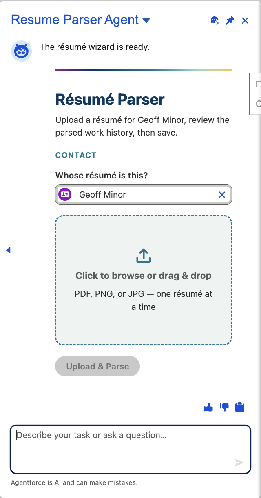
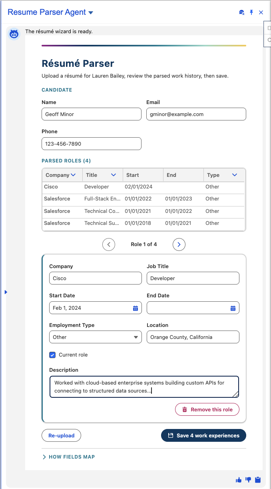

# Résumé Parser for Salesforce

A Salesforce reference implementation with a production-installable released package that turns an
uploaded résumé into structured **Work Experience** records under a **Contact** — through an in-chat
Agentforce wizard that lets the user review and edit extracted fields before work-history rows are saved.

[](https://developer.salesforce.com/)
[](LICENSE.txt)

## 🎯 Overview

A recruiter opens the **Résumé Parser** agent, names the Contact the résumé is for, and — after the
agent resolves and confirms that Contact conversationally — an interactive wizard renders **right in
the chat** (a custom Lightning type). The wizard:

1. parses the uploaded PDF/PNG/JPG with a GenAI vision prompt template (no Document AI),
2. shows the parsed candidate info + a table of roles with a left/right pager,
3. lets the user inline-edit any field, then
4. saves `Work_Experience__c` children under a `Resume_Data__c` record **linked to the Contact**.

The Contact record page shows a **Resume Data** related list, so every committed résumé rolls up to
the candidate. Recommitting the same Draft replaces its role children rather than duplicating them.

| Confirm the Contact & upload | Review & edit parsed roles, then save |
|---|---|
|  |  |

> The screenshots use intentionally altered, synthetic demonstration data. They do not show customer
> or employee records.

### What makes it work

- **In-chat wizard via a custom Lightning type** — the whole capture lives in the conversation, no
  page navigation. The agent renders the wizard as the sole action of its own subagent (the render
  rule) and hands off to it deterministically after the user confirms the Contact.
- **Standard CRM actions, not custom Apex, for contact resolution** — `IdentifyRecordByName` +
  `GetRecordDetails` find and enrich the Contact; Apex is reserved for JSON coercion and the
  idempotent write.
- **Draft-then-confirm** — upload creates a temporary Draft résumé and stores its file so the prompt
  can parse it. Work-experience children are written only after approval. Re-upload removes the current
  temporary draft and file; closing the session can leave a Draft record for an administrator to review.

---

## 🚀 Install

The solution installs in two parts: an **unlocked package** (objects, Apex, wizard LWC + custom
Lightning type, prompt template, flow, permission set) and the **Agent Script agent**, which can't be
packaged (see [below](#whats-in-the-package-vs-the-agent-step)) and deploys from this repo's `agent/`
source via a script. Follow the steps in order — a brand-new machine starts at step 0.

### 0. Prerequisites (one-time, per machine)

- **Salesforce CLI** with the agent plugin:
  ```bash
  sf --version                 # if missing, install from https://developer.salesforce.com/tools/salesforcecli
  sf plugins install agent
  ```
- **git** and **python3** (the agent script uses python3 to identify the exact version it published).
- A **target org with Agentforce / Einstein enabled** (Developer Edition or sandbox with Agentforce
  on). A bare scratch org can host the package but can't publish the agent.

### 1. Clone this repo

```bash
git clone https://github.com/salesforce/Resume_Parser.git
cd Resume_Parser
```

### 2. Authenticate your org and note its alias

```bash
sf org login web --alias my-org        # opens a browser; log into the target org
sf org list                            # confirm "my-org" is listed
```

`<your-org>` in every command below is that **alias** (or the full username). The CLI stores this
login globally on your machine, so you run the scripts from the cloned repo folder but they act on
whatever org you pass via `<your-org>` — the folder isn't tied to any org.

### 3. Install everything (one command, run from the repo root)

```bash
./install.sh <your-org> 04tHu000004hhiJIAQ
```

This runs the three steps below in order. To run them individually instead:

```bash
# 3a. Install the unlocked package
sf package install --package 04tHu000004hhiJIAQ --target-org <your-org> \
  --apex-compile package --wait 20 --no-prompt

# 3b. Deploy + publish the agent and activate the exact version just created
./deploy-agent.sh <your-org>

# 3c. Assign the permission set
sf org assign permset --name "Resume_Parser_User" --target-org <your-org>
```

> **Use `--apex-compile package`** (not "compile all"). "Compile all" recompiles *every* Apex class
> already in your org — if any unrelated class has a pre-existing compile error, the whole install
> rolls back with a misleading error. Scoping compilation to the package avoids that.

### 4. Manual Setup verification

1. **Verify the Lightning Agentforce panel.** In Setup, open **Agentforce Agents**, select
   **Resume Parser Agent**, and confirm the version printed by `deploy-agent.sh` is Active. Verify the
   agent is available in the Lightning Agentforce panel your users will use. If it isn't, configure the
   supported employee-agent panel/channel in Setup for your org and release; do not edit generated agent
   metadata.
2. **Grant agent access.** The agent isn't in the package, so the packaged permission set can't
   reference it. In Setup → **Permission Sets → Resume Parser User → Agent Access**, add
   `Resume_Parser_Agent`, then confirm the permission set is assigned to your users.
3. **Add the related list.** Setup → Object Manager → **Contact** → Page Layouts → add the
   **Resume Data** related list, so parsed résumés show on the Contact.

### 5. Try it

Open the Agentforce panel and say **"add a résumé for [contact name]."** The agent resolves the
Contact, confirms it, and opens the upload wizard in the chat.

---

**Package version:** `Resume Parser@3.2.1-1` → `04tHu000004hhiJIAQ` (code-coverage validated, **promoted to Released** — installs in production). This released package predates the unreleased 3.3 source's temporary Draft/file cleanup. Orgs installing 3.2.1 should include unconfirmed Drafts/files in their retention process; source deployments receive the 3.3 behavior described above. As an alternative to the CLI in step 3a, install the package via a browser URL — then continue from step 3b:

```
Developer / Sandbox: https://test.salesforce.com/packaging/installPackage.apexp?p0=04tHu000004hhiJIAQ
Production:          https://login.salesforce.com/packaging/installPackage.apexp?p0=04tHu000004hhiJIAQ
```

> If installing via the browser URL, choose **"Compile only the Apex in the package"** (same reason
> as `--apex-compile package` above).

---

## What's in the package vs. the agent step

GenAI metadata **does** package in a 2GP unlocked package — confirmed by building a code-coverage
validated version (prompt template + GenAiFunction + custom Lightning type + Einstein-calling Apex).
Two requirements make it work, both already configured here:
- `packageMetadataAccess: { "permissionSets": ["EinsteinGPTPromptTemplateManager"] }` in `sfdx-project.json`
- the package-validation scratch org enables Einstein (`Einstein1AIPlatform` + `enableEinsteinGptPlatform`)

The **one thing that can't be packaged** is the agent itself: it's a next-gen **Agent Script (ASL)**
agent, and `sf agent generate template` (the supported "package an agent as a template" path)
explicitly does not support Agent-Script agents. So the agent ships as a source bundle under
`agent/` and installs via `deploy-agent.sh` (deploy → `sf agent publish` → identify the new version →
activate that exact version). Panel availability is then verified/configured through supported Setup UI;
the script never edits generated Bot or planner metadata.

| Layer | Path | Installs via |
|---|---|---|
| **Full app** (objects, Apex, LWC, CLT, prompt template, GenAiFunction, flows, permission set) | `force-app/` | unlocked package `04tHu000004hhiJIAQ` |
| **Agent** (Agent Script) | `agent/` | `deploy-agent.sh` (`sf agent publish/activate`) |

For the deeper architecture (diagrams, decisions, data model), see
[`RESUME_PARSER_ARCHITECTURE.md`](RESUME_PARSER_ARCHITECTURE.md).

---

## Requirements

- Target org has **Einstein / Agentforce** enabled. A Developer Edition or sandbox with Agentforce
  on works; a bare scratch org can host the package but typically can't publish the agent without
  Agentforce provisioning.
- `sf` CLI with the `agent` plugin (`sf plugins install agent`). API 66.0+.

## Verified

- Full-app package `04tHu000004hhiJIAQ` **builds code-coverage validated (89%) and is promoted to
  Released** — it installs in production as well as sandbox/dev. Components: objects, the
  `Resume_Field_Map__mdt` custom metadata type + records, the required `Contact__c` lookup, Apex,
  `resumeWizard` LWC, `resumeWizard` custom Lightning type, `Extract_Work_Experience` prompt template,
  `resumeWizard_Output` GenAiFunction + flow, and the single `Resume Parser User` permission set.
- **`ResumeWizardController` Apex tests pass (19/19) in the build's validation org.**

## Manual steps the platform can't automate

| Step | Where | Why |
|---|---|---|
| Verify/configure the intended **Lightning Agentforce panel** | Setup → Agentforce Agents → Resume Parser Agent | Surface/channel availability varies by org and release; use supported Setup UI, not generated metadata edits |
| Add the **Resume Data** related list to the **Contact** layout | Setup → Object Manager → Contact → Page Layouts | A package shouldn't overwrite a subscriber's standard Contact layout |
| Grant **agent access** in a permission set | add `<agentAccesses><agentName>Resume_Parser_Agent</agentName><enabled>true</enabled></agentAccesses>`, re-assign | The agent isn't in the package |
| Assign **Resume Parser User** to end users | Setup → Permission Sets | One set grants data, Apex, and flow access (add the agent-access entry above first) |

## Notes

- Committing the same Draft résumé replaces its work-experience children rather than appending them.
  Re-upload removes the current temporary Draft/file before starting over. If a user closes the session
  instead, an unconfirmed Draft can remain and should be handled by the adopting org's retention policy.
- Supported file types: `.pdf`, `.png`, `.jpg` (`.jpeg` is unreliable for vision — convert to `.jpg`).

## Versions

**Unreleased (source): v3.3.0** — makes the extraction prompt **fully CMDT-driven**: the
`Extract_Work_Experience` template no longer hardcodes the field schema; the entire key list (candidate
keys + the `workExperiences[]` role keys) is built from the active `Resume_Field_Map__mdt` rows by
`ResumeParsing.buildExtraInstructions()` and injected via the template's `ExtraInstructions` input.
An admin can retarget or tune the existing candidate/role wire keys through CMDT with no prompt-template
change. Adding a brand-new wire key also requires the typed Apex DTO and review UI to support that key.
The single (v1) template version runs on **GPT-5 Mini** (`sfdc_ai__DefaultGPT5Mini`). The 3.3 source
also removes temporary Draft/files after parse failure or Re-upload and uses supported exact-version
agent activation without editing generated planner metadata. This source is **not yet packaged**; build
and promote a new package version before treating those changes as production-installable (see the
rebuild command below).

**Last built / Released: `04tHu000004hhiJIAQ` (v3.2.1-1)** — code-coverage validated (89%) and
**promoted to Released**, so it installs in **production** as well as sandbox/dev. This is the version
to install today. Changes vs. 3.2.0: makes the agent **publishable on current Agentforce** — the
resolved Contact Id is passed inside the wizard's `Details` JSON (the dedicated action-input approach in
3.1.0/3.2.0 couldn't publish, since the genAiFunction only surfaces `Details`), and the now-unused
`contactId` plumbing is removed from the flow and `ResumeWizardData`. Keeps the v3.2.0 "How fields map"
disclosure. **Note:** 3.2.1-1 still ships the older hardcoded-schema prompt; the v3.3.0 source above
supersedes it once packaged.

All earlier versions are **deprecated** — install v3.2.1-1 only:
- `04tHu000004hhiEIAQ` (v3.2.0-1) — field-map disclosure, but the agent won't publish on current Agentforce (dedicated contactId input).
- `04tHu000004hhi4IAA` (v3.1.0-1) — data-driven `Resume_Field_Map__mdt` field map, but the agent won't publish on current Agentforce.
- `04tHu000004hhWpIAI` (v3.0.1-1) — hardcoded field mapping; single `Resume_Parser_User` permission set and themed wizard.
- `04tHu000004hhWkIAI` (v3.0.0-1) — same as 3.0.1 but built before the theme comments were genericized.
- `04tHu000004hhWfIAI` (v2.0.0-1) — skip-validation beta (sandbox/dev only), two permission sets, un-themed wizard.
- `04tHu000004hhWaIAI` (v1.0.0-1) — initial release.

To rebuild after future changes (the Einstein scratch-def is required so the validation org has the
prompt-template feature):

```bash
sf package version create --package "Resume Parser" --definition-file config/project-scratch-def.json \
  --code-coverage --installation-key-bypass --wait 90 --target-dev-hub <hub>
sf package version promote --package "Resume Parser@<new>" --no-prompt --target-dev-hub <hub>
```
