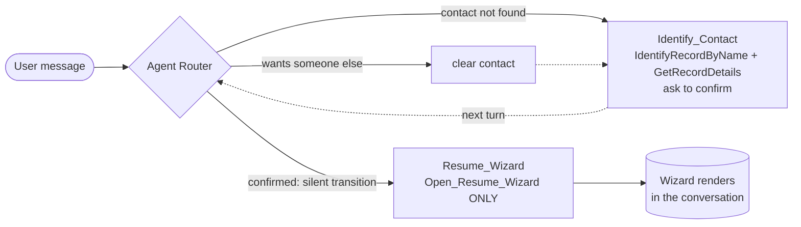
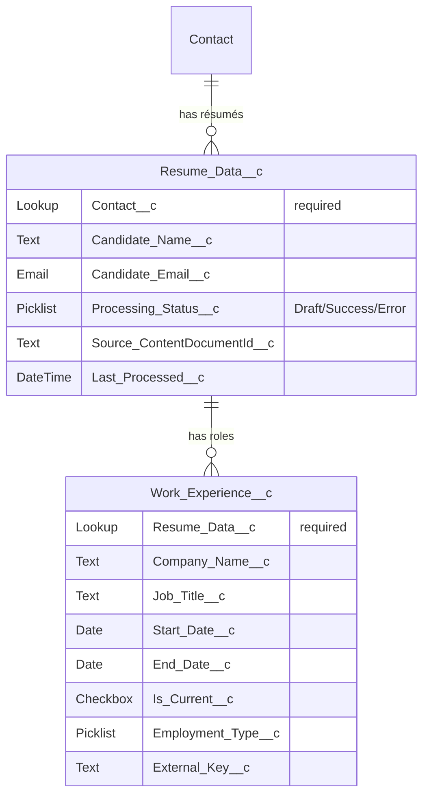
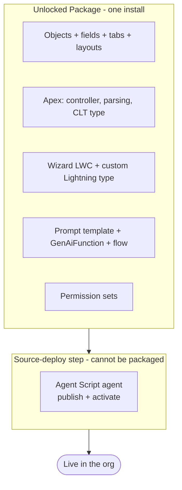

# Résumé Parser — Solution Architecture

*For the implementation partner / SI evaluating, installing, and operating this component inside a Salesforce org. After reading, you will know what it does, how the pieces fit, how it installs, and what to plan for.*

---

## 1. The 30-Second Summary

Recruiting and talent teams receive résumés as files and re-key them into the CRM by hand — slow, inconsistent, and error-prone. **Résumé Parser** replaces that with a conversational Agentforce experience: a user opens the agent, picks the Contact the résumé belongs to, uploads a PDF/PNG/JPG, and an interactive wizard stores a temporary Draft/file for parsing, then lets the user review and edit the extracted work history before role records are committed.

1. **Upload in chat** — a custom Lightning type renders a file-upload + Contact-picker wizard directly inside the Agentforce conversation.
2. **Parse with a prompt template** — a Flex prompt template (vision model) extracts candidate details and every role into structured data. No Document AI.
3. **Review, edit, then commit** — the wizard shows the parsed roles in a table with a record pager and inline editing; on confirm, Apex writes `Work_Experience__c` records under a `Resume_Data__c` record linked to the chosen Contact.

System boundary: the component captures and structures résumé data into Salesforce records linked to a Contact. Downstream matching, scoring, or ATS sync are out of scope and left as deliberate extension points.

---

## 2. Salesforce Products & Capabilities Used

| Product / Capability | Role in the Solution | Note |
|---|---|---|
| **Agentforce (Agent Builder 2.0 / Agent Script)** | The conversational surface. A standalone employee agent renders the wizard and orchestrates the experience. | Authored in Agent Script (ASL); runs the Atlas planner. |
| **Custom Lightning Type (CLT)** | Renders the interactive wizard LWC inside the chat conversation as structured, displayable output. | `resumeWizard` type → `resumeWizard` LWC. |
| **Prompt Template (Flex, vision)** | Parses the uploaded résumé file into candidate fields + a list of roles, as strict JSON. | `Extract_Work_Experience`, grounded on the uploaded file. |
| **Apex (invocable + `@AuraEnabled`)** | Persists a temporary Draft/file, invokes the template, coerces/validates JSON, and replaces role children on confirmed commit. | `ResumeWizardController`, `ResumeParsing`. |
| **Lightning Web Component** | The multi-step wizard UI: upload → preview table + record pager + inline edit → confirm. | `resumeWizard`, SLDS 2 styling hooks. |
| **Standard CRM actions** | The agent resolves the Contact by name and enriches the confirmation with the contact's email/phone/account — using stock EmployeeCopilot actions, no custom Apex. | `IdentifyRecordByName`, `GetRecordDetails`. |
| **Flow (autolaunched)** | Bridges the agent action to the CLT so the wizard renders in the conversation. | `resumeWizard_Output`. |
| **Custom Objects** | The data model: one résumé record per upload, one child record per role, both anchored to a Contact. | `Resume_Data__c`, `Work_Experience__c`. |
| **Permission Set** | A single set grants the app: object/field/tab access, Apex, and flows. (Agent access is **not** in this set — the agent isn't in the package, so it's granted separately post-deploy; see §8/§9.) | `Resume Parser User`. |

**Not used (deliberately):** Document AI / OCR services (the vision prompt template covers extraction), external ATS connectors, Data Cloud, and **custom Apex for CRM reads** (the agent uses stock EmployeeCopilot actions to resolve and read the Contact). Extraction is a prompt template invocation, so the only AI dependency is Agentforce enablement plus Flex credits for the model calls.

---

## 3. System at a Glance


The agent resolves and confirms the Contact conversationally, then renders the wizard; from that point the wizard owns the upload → parse → review → commit lifecycle through Apex. The agent never writes résumé data directly — the trust boundary is the `@AuraEnabled` controller: it validates the Contact, coerces the model's JSON, and is the only path that writes records.

### Agent orchestration (how the wizard reliably opens)

The agent is authored in Agent Script with a deliberate two-pass structure that solves a hard platform constraint: **a custom-Lightning-type wizard renders in the chat panel only when its action is the sole action of its subagent.** So confirming the contact and opening the wizard cannot happen in one step.



The confirmation is interpreted in the router itself, and the hand-off to the wizard is a **deterministic transition at the top of the router's reasoning** — so the moment the user confirms, the router switches to the wizard subagent *without emitting any text*, and the wizard is the only thing that speaks. This is what keeps the wizard rendering reliably and the messaging clean.

---

## 4. The User Journey (Upload → Review → Commit)

The experience is a conversational front-half (resolve and confirm the Contact) followed by a single in-chat wizard with a deliberate **parse-then-confirm** split — nothing is written to the work-history table until the user approves it.

- **Step −1 — Find & confirm the Contact (in chat).** The user names who the résumé is for. The agent resolves the Contact (`IdentifyRecordByName`), enriches it with email/phone/account (`GetRecordDetails`), and asks one confirmation question — *"I found Jane Doe — account: …, email: …, phone: …. Ready to open the résumé wizard?"* On "yes" the agent hands off to the wizard; on "no, I meant someone else" it clears the contact and re-searches.
- **Step 0 — Contact (in the wizard).** The wizard opens pre-filled with the confirmed Contact. The picker stays editable, so the user can still switch contacts here without leaving the wizard. Selection is required before upload.
- **Step 1 — Upload.** The user drops a PDF/PNG/JPG. Apex persists a temporary `Resume_Data__c` record in **Draft** status, attaches the file, invokes the prompt template, and stores parsed candidate-level fields on the Draft. The editable result returns to the wizard — **no `Work_Experience__c` records exist yet.** Parse failure removes the temporary Draft/file; choosing Re-upload removes the current temporary Draft/file before starting again. Closing the session can leave a Draft for the adopting org's retention policy.
- **Step 2 — Review & edit.** The wizard shows candidate fields plus a table of every role, with left/right paging to step through each one as an editable card. The user corrects anything the model got wrong.
- **Step 3 — Commit.** On confirm, Apex writes the reviewed roles as `Work_Experience__c` children and stamps the résumé **Success**. Recommitting the same Draft replaces its child set rather than appending duplicates.

```mermaid
sequenceDiagram
    autonumber
    actor U as Recruiter
    participant W as Wizard (LWC)
    participant A as Apex Controller
    participant P as Prompt Template
    participant D as Records

    U->>W: Pick Contact + upload résumé
    W->>A: uploadAndParse(file, contactId)
    A->>D: Create Resume_Data__c (Draft) + attach file
    A->>P: Invoke Extract_Work_Experience (vision)
    P-->>A: Candidate + roles as JSON
    A-->>W: Editable fields (Draft parent + file persisted; no role children)
    U->>W: Review, edit, confirm
    W->>A: commitDrafts(resumeId, editedRows)
    A->>D: Replace Work_Experience__c set, stamp Success
    A-->>W: Saved count
    Note over D: Roles now visible on the Contact's Resume Data related list
```

---

## 5. Data Model



The model is a two-level hierarchy under a Contact: **Contact → Resume Data → Work Experiences.** Every résumé is required to belong to a Contact, so résumés and their parsed roles roll up to the candidate and appear on the Contact record page as a related list. `External_Key__c` supports stable child identity, while commit replaces the children of the same Draft (see decisions).

### The field map (`Resume_Field_Map__mdt`) — mappings are data, not code

The prompt instructions and target mapping for each supported wire key are defined in a **custom metadata type**, `Resume_Field_Map__mdt`. An admin can retarget or tune existing candidate/role keys—target field, length, hint, or allowed picklist values—without changing the prompt template. Adding a brand-new wire key also requires a matching member in the typed Apex DTO and a review control in the LWC.

| Field | Purpose |
|---|---|
| `Parse_Key__c` | The JSON key the prompt emits and the wizard/commit reads (e.g. `company`). Also the draft field name the LWC round-trips — the single wire contract across prompt, LWC, and Apex. |
| `Target_Object__c` | Routes the mapping to the **parent** `Resume_Data__c` (a single candidate-level field, read from a top-level JSON key) or a **child** `Work_Experience__c` row (a repeating field, read from each element of the `workExperiences[]` array). This parent/child routing is the one dimension a flat map doesn't need. |
| `Target_Field_API_Name__c` | The field the value is written to on commit. Blank = shown/extracted but never written. |
| `Data_Type__c` | Drives coercion: `Date`→Date, `Checkbox`→Boolean, `Picklist`→snapped to Picklist Values, `Number`→Decimal, `Text`/`Email`/`Phone`→truncated to Max Length. |
| `Picklist_Values__c` | Allowed values for a `Picklist` field (externalizes what used to be a hardcoded employment-type list). |
| `Max_Length__c` | Truncation length for text values (externalizes the old hardcoded 255/80/40/32000). |
| `Extraction_Hint__c` | Per-key synonyms/instructions; `buildExtraInstructions()` appends this to each key's line in the CMDT-generated prompt schema. |
| `Include_In_Prompt__c` · `Show_In_Review__c` · `Read_Only__c` · `Is_Active__c` · `Sort_Order__c` | Whether the AI is asked for it, whether it's shown in the review form, whether it's editable, whether the mapping is live, and its display order. |

`ResumeParsing.activeMappings()` reads these rows (with a `@TestVisible` override seam so tests inject mappings in-memory). `toDrafts()` builds the review drafts by looping the map and reading each `Parse_Key__c`; the commit loops the map and does a dynamic `sObject.put(apiName, coercedValue)`, routing each value to the parent résumé or the child rows by `Target_Object__c`.

**Field-map disclosure (v3.2.0).** The wizard surfaces the active map read-only: a collapsible **"How fields map"** section (default collapsed) lists each parse key → target object/field, type, and access. It's fed by `ResumeWizardController.getFieldMap()` (cacheable) → `ResumeParsing.fieldMapViews()`, which projects each active row and resolves the target field's label from the object describe (best-effort). This disclosure is display-only; edits to existing supported CMDT rows appear without a code change.

> The résumé prompt template has **no hardcoded field list**. `ResumeParsing.buildExtraInstructions()` builds the extraction schema from the active `Resume_Field_Map__mdt` rows—top-level candidate keys plus a nested `workExperiences[]` array—then injects it through `{!$Input:ExtraInstructions}`. The template body stays generic. CMDT can retarget or tune the existing typed wire keys without a template change; a brand-new wire key also requires Apex DTO and LWC support.

---

## 6. Component Inventory

- **Schema:** `Resume_Data__c` (candidate fields, processing status, required `Contact__c` lookup), `Work_Experience__c` (role fields, required parent lookup, external key), `Resume_Field_Map__mdt` (the CMDT field map — one record per parsed field), tabs, and record layouts.
- **AI layer:** `Extract_Work_Experience` — a Flex, vision prompt template grounded on the uploaded file, returning strict JSON. Its field schema is fully CMDT-driven (single v1 version, injected via `ExtraInstructions`); default model is **GPT-5 Mini** (`sfdc_ai__DefaultGPT5Mini`), swappable in the template.
- **Code:** `ResumeWizardController` (`@AuraEnabled` upload/parse/commit), `ResumeParsing` (JSON coercion, date/picklist normalization, idempotent replace), `ResumeWizardData` (the CLT's backing type), plus unit tests.
- **UI:** `resumeWizard` LWC (the wizard) and `resumeWizard` custom Lightning type that renders it in chat; `resumeWizard_Output` flow that surfaces it to the agent.
- **Agent:** `Resume_Parser_Agent` — a standalone Agent Script employee agent: a router that resolves/confirms the Contact (using stock `IdentifyRecordByName` + `GetRecordDetails`) and a wizard subagent that opens the CLT. No custom Apex actions on the agent.
- **Access:** a single `Resume Parser User` permission set (objects/fields/tabs + Apex + flows). Agent access is a separate manual grant post-deploy (the agent isn't packaged).

---

## 7. Architecture Decisions, Distilled

| Decision | Why |
|---|---|
| **Persist a Draft, commit roles on confirm** | The stored Draft/file supports model grounding; the user reviews extracted fields before any `Work_Experience__c` children are written. |
| **Required `Contact__c` lookup on the résumé** | Every résumé must roll up to a candidate; powers the Contact related list and keeps data anchored. |
| **Prompt template, not Document AI** | Extraction is a single Flex vision prompt-template invocation — fewer moving parts, no separate OCR product to license. |
| **Idempotent child commit (replace, not append)** | Recommitting the same Draft replaces its existing role children; Re-upload explicitly removes the current temporary Draft/file before starting over. |
| **Existing wire-key mappings live in custom metadata (`Resume_Field_Map__mdt`)** | Target field, type/length/hint/picklist behavior for supported candidate/role keys is data, not prompt-template code. New wire keys still require typed Apex and LWC support. |
| **Wizard owns the flow via Apex; agent just renders it** | The in-chat surface has no API to push data back to the conversation, so the LWC calls Apex directly — robust on every surface. |
| **Stock CRM actions for contact resolution, not custom Apex** | `IdentifyRecordByName` + `GetRecordDetails` resolve and enrich the Contact; no Apex to write, test, or package for a standard read. Apex is reserved for what only Apex can do (JSON coercion, idempotent writes). |
| **Confirm in the router + deterministic silent hand-off** | The wizard CLT renders only as the sole action of its subagent, so confirm and open are separate passes. Interpreting the "yes" in the router and transitioning at the top of reasoning hands off without stray chatter and keeps the wizard rendering reliably. |
| **One permission set for the app** | A single `Resume Parser User` set covers objects/fields/tabs, Apex, and flows — one assignment for the packaged app. Agent access is added to the set manually after the agent is deployed (it can't be packaged), then re-assigned. |

---

## 8. How It's Packaged & Installed

Almost the entire solution ships as a single **unlocked package** — including the GenAI prompt template, the GenAiFunction, the custom Lightning type, and the Einstein-invoking Apex. The **one exception is the agent**: an Agent Script agent cannot be packaged, so it installs as a short source-deploy step.



- **Package:** `sf package install` (objects, Apex, LWC, CLT, prompt template, GenAiFunction, flows, permission set). Requires `packageMetadataAccess` for the prompt template and an Einstein-enabled org.
- **Agent:** deploy the authoring bundle, publish it, identify the newly created version, and activate that exact version. `deploy-agent.sh` automates those supported steps and never edits generated agent metadata. Panel availability is verified/configured manually through supported Setup UI.
- **One command:** `install.sh <org> <packageVersionId>` runs both and assigns the permission set.

> **Production note.** A production-installable package version requires a code-coverage–validated build that is then promoted to "Released." A beta (skip-validation) version installs in sandbox/Developer orgs only.

---

## 9. What the Implementation Team Should Plan For

1. **Agentforce enablement.** The org needs Agentforce/Einstein turned on and Flex credits available for the prompt-template invocations.
2. **The agent is a separate install step.** Budget the `deploy-agent.sh` run (publish + exact-version activate) after the package install — it can't ride inside the package.
3. **Verify the intended panel surface.** In Setup, confirm the activated version is available in the Lightning Agentforce panel your users will use. Configure the supported employee-agent panel/channel for that org/release if needed; never edit generated agent metadata.
4. **Grant agent access.** Activating the agent does not make it visible to users, and — because the agent isn't in the package — the packaged `Resume Parser User` permission set does **not** include an agent-access entry. After deploy, add `<agentAccesses><agentName>Resume_Parser_Agent</agentName><enabled>true</enabled></agentAccesses>` to the set and re-assign it (see the README).
5. **Add the related list to the Contact layout.** The package doesn't overwrite the standard Contact layout, so add the **Resume Data** related list in Object Manager.
6. **Assign the `Resume Parser User` permission set** to end users — after the separate agent-access entry is added, one assignment grants the app and agent access.
7. **File types.** `.pdf`, `.png`, `.jpg` are the documented inputs; validate the configured model with sanitized representative files in the target org.
8. **Production version.** If installing to production, use a code-coverage–validated package version promoted to Released.

---

## 10. What This Generalizes To

1. **Any "file → structured child records under a parent" intake.** Résumés → work history is one instance; invoices → line items, applications → answers, claims → line details all follow the same shape.
2. **Draft-then-confirm as a trust pattern.** The system can persist a temporary parent/file required for model grounding while deferring business child records until human approval; storage/cleanup must be disclosed.
3. **In-chat wizards via custom Lightning types.** Any multi-step capture that belongs in the conversation (not a separate page) can be delivered as a CLT-rendered LWC that calls Apex directly.
4. **Replace-on-commit children.** Recommitting the same parent benefits from replacing its child set so approved data stays coherent.
5. **Confirm-then-render agent orchestration.** Any agent that must collect a confirmation before showing an interactive component reuses the pattern: interpret the answer in the router, set state, and transition deterministically at the top of reasoning so the component opens in its own clean step.

Swap the prompt template and the child object, and the same architecture holds for the next document-intake use case.
