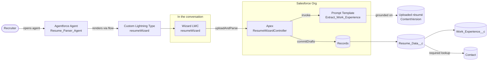
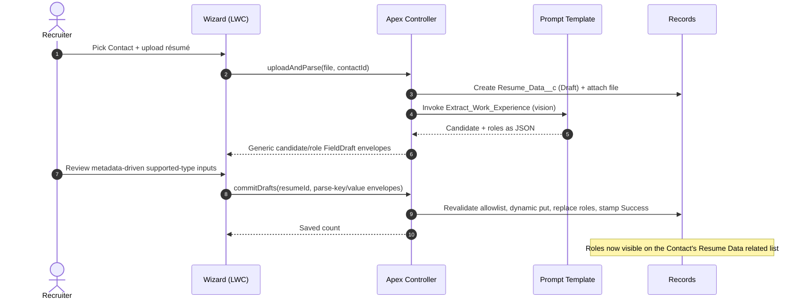
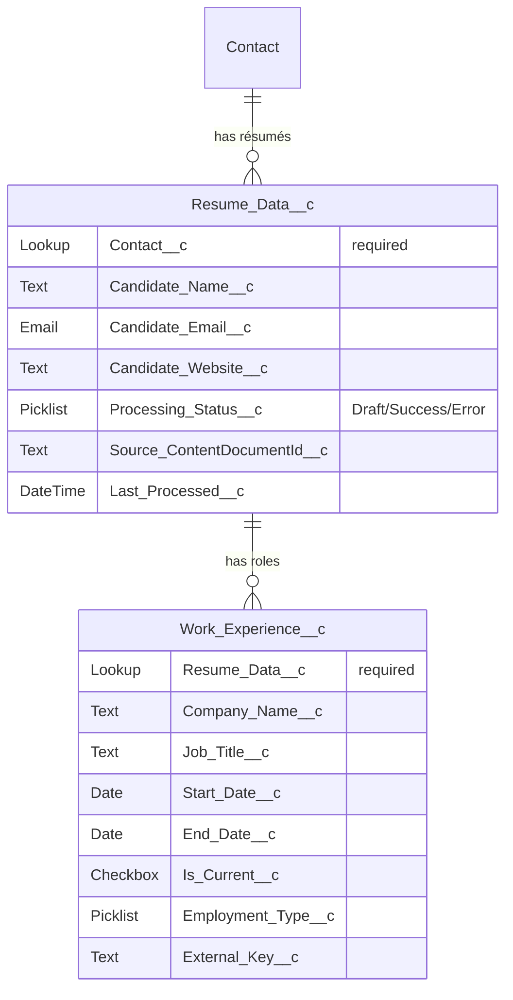
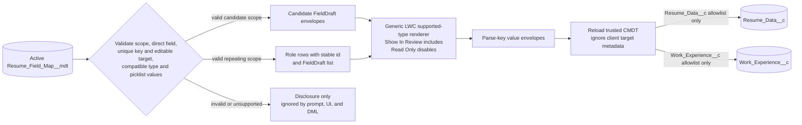
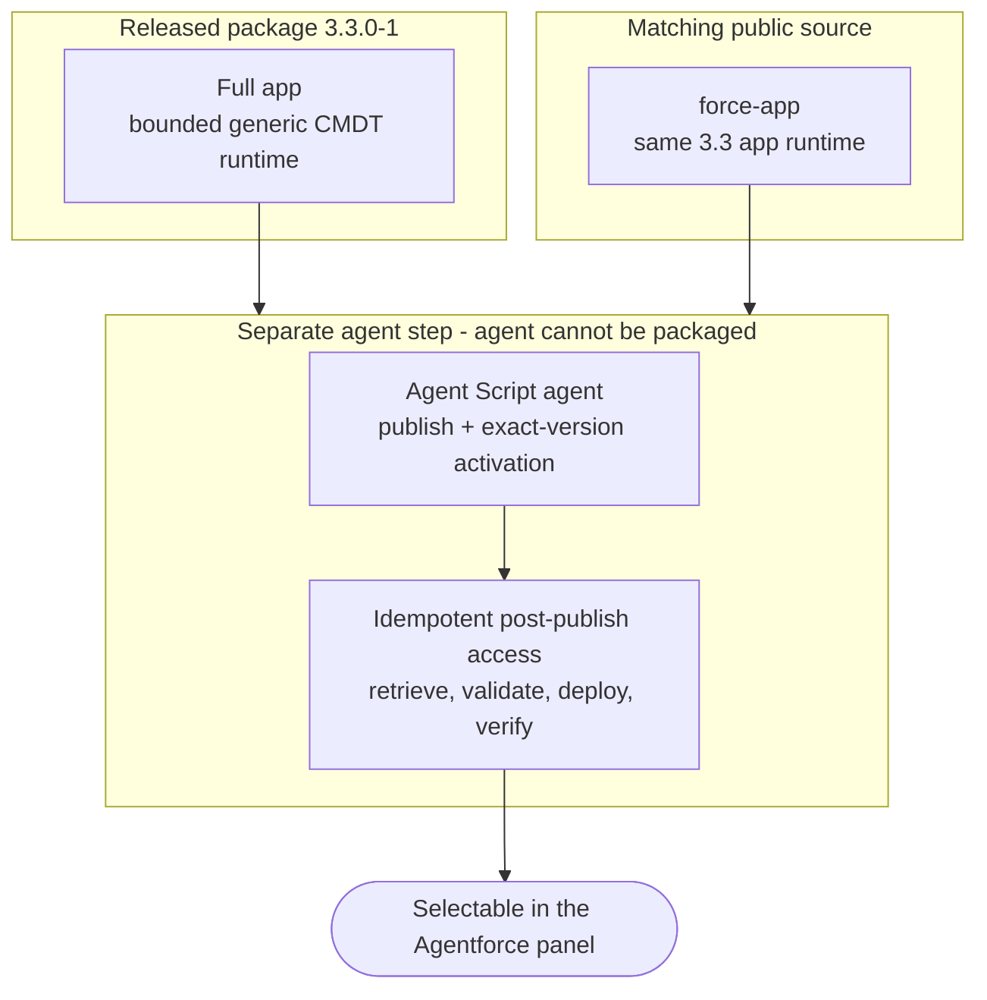

# Résumé Parser — Solution Architecture

*For the implementation partner / SI evaluating, installing, and operating this component inside a Salesforce org. After reading, you will know what it does, how the pieces fit, how it installs, and what to plan for.*

> **Distribution status.** Released package **3.3.0-1** (`04tbm000000j6Z7AAI`) is code-coverage
> validated at 92%, promoted to Released, production-installable, and contains the bounded generic CMDT
> runtime described here. Public `force-app/` source matches that app runtime and remains available for
> enabled non-production source deployments. The Agent Script agent publishes separately.

---

## 1. The 30-Second Summary

Recruiting and talent teams receive résumés as files and re-key them into the CRM by hand — slow, inconsistent, and error-prone. **Résumé Parser** replaces that with a conversational Agentforce experience: a user opens the agent, picks the Contact the résumé belongs to, uploads a PDF/PNG/JPG, and an interactive wizard stores a temporary Draft/file for parsing, then lets the user review and edit the extracted work history before role records are committed.

1. **Upload in chat** — a custom Lightning type renders a file-upload + Contact-picker wizard directly inside the Agentforce conversation.
2. **Parse with a prompt template** — a Flex prompt template (vision model) extracts candidate details and every role into structured data. No Document AI.
3. **Review, edit, then commit** — the wizard shows the parsed roles in a table with a record pager and inline editing; on confirm, Apex writes `Work_Experience__c` records under a `Resume_Data__c` record linked to the chosen Contact.

System boundary: the component captures and structures résumé data into Salesforce records linked to a Contact. Downstream matching, scoring, or ATS sync are out of scope and left as deliberate extension points.

---

## 2. Salesforce Products & Capabilities Used

| Product / Capability | Role in the Solution | Note |
|---|---|---|
| **Agentforce (Agent Builder 2.0 / Agent Script)** | The conversational surface. A standalone employee agent renders the wizard and orchestrates the experience. | Authored in Agent Script (ASL); runs the Atlas planner. |
| **Custom Lightning Type (CLT)** | Renders the interactive wizard LWC inside the chat conversation as structured, displayable output. | `resumeWizard` type → `resumeWizard` LWC. |
| **Prompt Template (Flex, vision)** | Parses the uploaded résumé file into candidate fields + a list of roles, as strict JSON. | `Extract_Work_Experience`, grounded on the uploaded file. |
| **Apex (invocable + `@AuraEnabled`)** | Persists a temporary Draft/file, invokes the template, coerces/validates JSON, and replaces role children on confirmed commit. | `ResumeWizardController`, `ResumeParsing`. |
| **Lightning Web Component** | The multi-step wizard UI: upload → preview table + record pager + inline edit → confirm. | `resumeWizard`, SLDS 2 styling hooks. |
| **Standard CRM actions** | The agent resolves the Contact by name and enriches the confirmation with the contact's email/phone/account — using stock EmployeeCopilot actions, no custom Apex. | `IdentifyRecordByName`, `GetRecordDetails`. |
| **Flow (autolaunched)** | Bridges the agent action to the CLT so the wizard renders in the conversation. | `resumeWizard_Output`. |
| **Custom Objects** | The data model: one résumé record per upload, one child record per role, both anchored to a Contact. | `Resume_Data__c`, `Work_Experience__c`. |
| **Permission Set** | A single set grants the app: object/field/tab access, Apex, and flows. (Agent access is **not** in this set — the agent isn't in the package, so it's granted separately post-deploy; see §8/§9.) | `Resume Parser User`. |

**Not used (deliberately):** Document AI / OCR services (the vision prompt template covers extraction), external ATS connectors, Data Cloud, and **custom Apex for CRM reads** (the agent uses stock EmployeeCopilot actions to resolve and read the Contact). Extraction is a prompt template invocation, so the only AI dependency is Agentforce enablement plus Flex credits for the model calls.

---

## 3. System at a Glance

The agent resolves and confirms the Contact conversationally, then renders the wizard; from that point the wizard owns the upload → parse → review → commit lifecycle through Apex. The agent never writes résumé data directly — the trust boundary is the `@AuraEnabled` controller: it validates the Contact, coerces the model's JSON, and is the only path that writes records.

### Agent orchestration (how the wizard reliably opens)

The agent is authored in Agent Script with a deliberate two-pass structure that solves a hard platform constraint: **a custom-Lightning-type wizard renders in the chat panel only when its action is the sole action of its subagent.** So confirming the contact and opening the wizard cannot happen in one step.

The confirmation is interpreted in the router itself, and the hand-off to the wizard is a **deterministic transition at the top of the router's reasoning** — so the moment the user confirms, the router switches to the wizard subagent *without emitting any text*, and the wizard is the only thing that speaks. This is what keeps the wizard rendering reliably and the messaging clean.

---

## 4. The User Journey (Upload → Review → Commit)

The experience is a conversational front-half (resolve and confirm the Contact) followed by a single in-chat wizard with a deliberate **parse-then-confirm** split — nothing is written to the work-history table until the user approves it.

- **Step −1 — Find & confirm the Contact (in chat).** The user names who the résumé is for. The agent resolves the Contact (`IdentifyRecordByName`), enriches it with email/phone/account (`GetRecordDetails`), and asks one confirmation question — *"I found Jane Doe — account: …, email: …, phone: …. Ready to open the résumé wizard?"* On "yes" the agent hands off to the wizard; on "no, I meant someone else" it clears the contact and re-searches.
- **Step 0 — Contact (in the wizard).** The wizard opens pre-filled with the confirmed Contact. The picker stays editable, so the user can still switch contacts here without leaving the wizard. Selection is required before upload.
- **Step 1 — Upload.** The user drops a PDF/PNG/JPG. Apex persists a temporary `Resume_Data__c` record in **Draft** status, attaches the file, invokes the prompt template, and stores parsed candidate-level fields on the Draft. The editable result returns to the wizard — **no `Work_Experience__c` records exist yet.** Parse failure removes the temporary Draft/file; choosing Re-upload removes the current temporary Draft/file before starting again. Closing the session can leave a Draft for the adopting org's retention policy.
- **Step 2 — Review & edit.** The wizard shows candidate fields plus a table of every role, with left/right paging to step through each one as an editable card. The user corrects anything the model got wrong.
- **Step 3 — Commit.** On confirm, Apex writes the reviewed roles as `Work_Experience__c` children and stamps the résumé **Success**. Recommitting the same Draft replaces its child set rather than appending duplicates.

<!-- Mermaid sequence-message semicolons must be entity-encoded because raw semicolons are statement separators. -->

---

## 5. Data Model

The model is a two-level hierarchy under a Contact: **Contact → Resume Data → Work Experiences.** Every résumé is required to belong to a Contact, so résumés and their parsed roles roll up to the candidate and appear on the Contact record page as a related list. `External_Key__c` supports stable child identity, while commit replaces the children of the same Draft (see decisions).

### The field map (`Resume_Field_Map__mdt`) — mappings are data, not code

The prompt instructions, target mapping, coercion, and review behavior are defined in `Resume_Field_Map__mdt`. Active validated rows become generic `FieldDraft` envelopes; the LWC repeats metadata-driven inputs and columns, then returns parse-key/value envelopes for a fresh server-side map to commit with dynamic `SObject.put`. An admin can therefore add a field without named DTO members or named LWC controls, but only inside the strict résumé allowlist: direct fields on `Resume_Data__c` (candidate scope) or `Work_Experience__c` (repeating role scope), using supported compatible types. Each active editable target field may have exactly one mapping in its scope. Duplicate target mappings are ambiguous configuration—not ordering—and every colliding row fails closed before prompt, UI, or DML. Other objects, relationship paths, duplicate keys/targets, missing/incompatible fields, unsupported widgets/types, and invalid generic picklists are disclosed as ignored.

| Field | Purpose |
|---|---|
| `Parse_Key__c` | The JSON key the prompt emits and the wizard/commit reads (e.g. `company`). It must be unique in its scope. Candidate mappings cannot use reserved structural key `workExperiences`, which exclusively names the repeating role array. |
| `Target_Object__c` | Routes the mapping to the **parent** `Resume_Data__c` (a single candidate-level field, read from a top-level JSON key) or a **child** `Work_Experience__c` row (a repeating field, read from each element of the `workExperiences[]` array). This parent/child routing is the one dimension a flat map doesn't need. |
| `Target_Field_API_Name__c` | A direct field on the allowed target object. An active editable `{Target Object, Target Field}` must be unique. Duplicate writable targets, blank/unknown/calculated/auto-number fields, and relationship paths fail closed. |
| `Data_Type__c` | Drives generic input and commit coercion. The configured type must match the compatibility table below; mismatch is disclosed and inert. |
| `Picklist_Values__c` | Allowed values for a `Picklist` field. They are included in prompt guidance; case/space/hyphen variants normalize to a configured value, while unsupported labels use the explicit `Other` fallback when present. |
| `Default_Value__c` | Optional generic value used only when model output is blank. Explicit model/review values win. The default must pass the same type/picklist compatibility checks or the mapping is inert. |
| `Max_Length__c` | Truncation length for text values (externalizes the old hardcoded 255/80/40/32000). |
| `Extraction_Hint__c` | Per-key synonyms/instructions; `buildExtraInstructions()` appends this to each key's line in the CMDT-generated prompt schema. |
| `Include_In_Prompt__c` · `Show_In_Review__c` · `Read_Only__c` · `Is_Active__c` · `Sort_Order__c` | Whether a validated row enters the prompt, renders in generic review/table UI, is disabled and excluded from commit, is active, and where it sorts. Hidden non-read-only values remain eligible for mapped persistence; read-only values never write. |

| CMDT type | Compatible described target |
|---|---|
| `Text` | String or Text Area |
| `Email` | Email or String |
| `Phone` | Phone or String |
| `URL` | URL or String |
| `Date` | Date only; defaults must exactly match a valid `YYYY`, `YYYY-MM`, or `YYYY-MM-DD` calendar value |
| `Checkbox` | Boolean only |
| `Number` | Integer, Double, Currency, or Percent |
| `Picklist` | Picklist only; every mapping must explicitly configure values and each value must be active on the target picklist |

The shipped Employment Type row keeps seven values, a cue-based closest-value hint, and configured default
`Full-time`. Contract/contractor/consultant cues map to Contract; freelance/self-employed to Freelance;
intern to Internship; temporary/seasonal to Temporary; when none of those cues exists, blank model output
uses Full-time. Explicit unmatched nonblank labels use `Other`. The value remains visible/editable in review.

`ResumeParsing.activeMappings()` reads active rows. Validation enforces the two allowed scopes, one active editable mapping per target, compatible direct field types, and target-compatible picklist values before a row can enter `buildExtraInstructions()`, `toDrafts()`, or commit. `toDrafts()` creates generic candidate `FieldDraft` envelopes and repeating role envelopes with stable row ids. The LWC renders by `inputKind`/`inputType`, returns only parse-key/value envelopes, and the server deliberately ignores client-supplied target metadata. Commit reloads the trusted map, locks the parent, dynamically coerces and puts allowed values, replaces the child set, and derives `External_Key__c` from the persisted company/title/start-date fields rather than parse-key names.

**Field-map projection and disclosure.** `ResumeWizardController.getFieldMap()` returns every active row, including invalid rows with `supported=false` and an issue. Only supported `Show_In_Review__c=true` rows become candidate inputs, role-detail inputs, or role-table columns. `Read_Only__c` disables the repeated input and the server excludes it from DML. Loading/failure fails closed by disabling upload until at least one supported row is available. The collapsible disclosure remains transparent about hidden, read-only, and ignored mappings.

**Responsive dynamic role table.** Every supported role mapping with Show In Review remains a table column. Column definitions carry stable type/label-aware initial widths and wrapped values. `lightning-datatable` owns the single continuous, keyboard-accessible horizontal scroll surface; there is no outer nested scroller or scroll-snap boundary. Narrow Agentforce panels expose—not hide—every dynamic column and full label through the datatable's scrolling/wrapping. This is presentation only; it never changes mapping inclusion or persistence.

> The prompt template has no hardcoded field list. Only validated prompt-enabled rows are injected as top-level candidate keys or nested `workExperiences[]` keys. This is Aurora-inspired dynamic rendering within the résumé allowlist—not an arbitrary-object automation engine—and intentionally omits Aurora-specific computed-date transforms, shared-field appends, relationship paths, and Opportunity assumptions.

**Admin workflow.** A future `Candidate_Linkedin__c`-style field needs no named Apex/LWC. Create or choose one dedicated direct field on Resume Data or Work Experience; grant readable/editable FLS to intended users and Resume Parser User; confirm no other active editable mapping targets that exact object/field; create exactly one active row with a unique parse key, compatible supported type, extraction hint, prompt/review/read-only flags, ordering/length, explicit target-active picklist values when applicable, and an optional type-compatible Default Value only when the admin intentionally wants blank model output to be guessed/defaulted. Close and reopen the wizard after metadata changes because `getFieldMap()` is cacheable and the component loads mappings when it connects. Use disclosure to confirm Editable and test hint-driven prompt output, review, and persistence in a non-production org. `Ignored:` duplicate/type/picklist issues are inert and must be corrected, followed by another reopen. The Candidate Website field/FLS/layout ship without a CMDT mapping; create exactly one mapping to enable it, then edit that row for later changes rather than adding a duplicate. The same flow covers future Candidate LinkedIn-style fields. New objects/widgets require reviewed source changes.

---

## 6. Released Package/Source 3.3 Component Inventory

- **Schema:** `Resume_Data__c` (candidate fields, processing status, required `Contact__c` lookup), `Work_Experience__c` (role fields, required parent lookup, external key), `Resume_Field_Map__mdt` (the CMDT field map — one record per parsed field), tabs, and record layouts.
- **AI layer:** `Extract_Work_Experience` — a Flex, vision prompt template grounded on the uploaded file, returning strict JSON. Its field schema is fully CMDT-driven (single v1 version, injected via `ExtraInstructions`); default model is **GPT-5 Mini** (`sfdc_ai__DefaultGPT5Mini`), swappable in the template.
- **Code:** `ResumeWizardController` (`@AuraEnabled` upload/parse/commit), `ResumeParsing` (JSON coercion, date/picklist normalization, idempotent replace), `ResumeWizardData` (the CLT's backing type), plus unit tests.
- **UI:** `resumeWizard` LWC (the wizard) and `resumeWizard` custom Lightning type that renders it in chat; `resumeWizard_Output` flow that surfaces it to the agent.
- **Agent:** `Resume_Parser_Agent` — a standalone Agent Script employee agent: a router that resolves/confirms the Contact (using stock `IdentifyRecordByName` + `GetRecordDetails`) and a wizard subagent that opens the CLT. No custom Apex actions on the agent.
- **Access:** a single packaged `Resume Parser User` permission set (objects/fields/tabs + Apex + flows) plus an idempotent post-publish `grant-agent-access.sh` reconciliation after the separate agent exists.

---

## 7. Architecture Decisions, Distilled

| Decision | Why |
|---|---|
| **Persist a Draft, commit roles on confirm** | The stored Draft/file supports model grounding; the user reviews extracted fields before any `Work_Experience__c` children are written. |
| **Required `Contact__c` lookup on the résumé** | Every résumé must roll up to a candidate; powers the Contact related list and keeps data anchored. |
| **Prompt template, not Document AI** | Extraction is a single Flex vision prompt-template invocation — fewer moving parts, no separate OCR product to license. |
| **Idempotent child commit (replace, not append)** | Recommitting the same Draft replaces its existing role children; Re-upload explicitly removes the current temporary Draft/file before starting over. |
| **Validated résumé field mappings live in custom metadata (`Resume_Field_Map__mdt`)** | New parse keys flow through generic field envelopes and repeated inputs without named DTO/control edits, but only for compatible direct fields on Resume Data or Work Experience. Invalid mappings are disclosed and inert. |
| **Wizard owns the flow via Apex; agent just renders it** | The in-chat surface has no API to push data back to the conversation, so the LWC calls Apex directly — robust on every surface. |
| **Stock CRM actions for contact resolution, not custom Apex** | `IdentifyRecordByName` + `GetRecordDetails` resolve and enrich the Contact; no Apex to write, test, or package for a standard read. Apex is reserved for what only Apex can do (JSON coercion, idempotent writes). |
| **Confirm in the router + deterministic silent hand-off** | The wizard CLT renders only as the sole action of its subagent, so confirm and open are separate passes. Interpreting the "yes" in the router and transitioning at the top of reasoning hands off without stray chatter and keeps the wizard rendering reliably. |
| **Packaged app permission, post-publish agent access** | `Resume Parser User` ships without a pre-agent dependency. After the separate agent exists, the idempotent helper adds/verifies only its access row; existing assignments inherit the update. |

---

## 8. How Package and Source Installation Differ

There are two app distributions, followed by the same separate Agent Script step:

- **Released package 3.3.0-1:** install `04tbm000000j6Z7AAI` with `sf package install`. It is
  code-coverage validated at 92%, promoted to Released, production-installable, and contains the bounded
  generic runtime, fields/defaults, and cleanup described in §§4–7.
- **Matching public source:** deploy `force-app/` only to an appropriately enabled non-production org.
  The packaged app was built from this runtime; future source changes require another validated/promoted
  package before they become production-package functionality.
- **Agent:** either app installation still requires separate authoring-bundle publication and narrow
  post-publish Agent Access reconciliation. Publishing the agent does not upgrade the installed app runtime.
- **Commands:** `install.sh <org> 04tbm000000j6Z7AAI` installs released 3.3; `install.sh <org>` selects
  matching 3.3 source deployment for non-production.

> **Production note.** Install Released package 3.3.0-1 for the bounded generic runtime in production.
> Do not substitute direct `force-app/` deployment for the production package install.

---

## 9. What the Implementation Team Should Plan For

1. **Agentforce enablement.** The org needs Agentforce/Einstein turned on and Flex credits available for the prompt-template invocations.
2. **The agent is a separate install step.** Budget the `deploy-agent.sh` run after released package 3.3 installation or a matching non-production source deploy. It publishes/activates the agent and reconciles access, but does not change the app runtime.
3. **Verify the intended panel surface.** In Setup, confirm the activated version is available in the Lightning Agentforce panel your users will use. Configure the supported employee-agent panel/channel for that org/release if needed; never edit generated agent metadata.
4. **Grant agent access after publication.** Activating the agent does not make it visible to users, and the packaged/source `Resume Parser User` permission set intentionally has no pre-agent dependency. `deploy-agent.sh` calls `grant-agent-access.sh`, which retrieves the current target set, adds only enabled `Resume_Parser_Agent` access when absent, validates/deploys, and retrieves again to verify. The helper is idempotent, so later agent republishes reinforce access without changing package install order or generated metadata.
5. **Add the related list to the Contact layout.** The package doesn't overwrite the standard Contact layout, so add the **Resume Data** related list in Object Manager.
6. **Assign the `Resume Parser User` permission set** to end users — one assignment grants the app plus the separately reconciled agent access; existing assignments inherit the update.
7. **File types.** `.pdf`, `.png`, `.jpg` are the documented inputs; validate the configured model with sanitized representative files in the target org.
8. **Admin dynamic-field configuration is released 3.3 behavior.** Grant FLS, create exactly one compatible mapping with hint/options/default policy, close/reopen the wizard, confirm disclosure, and validate review/persistence in a non-production org before broader use.
9. **Production version.** Install Released package 3.3.0-1 (`04tbm000000j6Z7AAI`) for the production-installable bounded generic runtime.

---

## 10. What This Generalizes To

1. **Any "file → structured child records under a parent" intake.** Résumés → work history is one instance; invoices → line items, applications → answers, claims → line details all follow the same shape.
2. **Draft-then-confirm as a trust pattern.** The system can persist a temporary parent/file required for model grounding while deferring business child records until human approval; storage/cleanup must be disclosed.
3. **In-chat wizards via custom Lightning types.** Any multi-step capture that belongs in the conversation (not a separate page) can be delivered as a CLT-rendered LWC that calls Apex directly.
4. **Replace-on-commit children.** Recommitting the same parent benefits from replacing its child set so approved data stays coherent.
5. **Confirm-then-render agent orchestration.** Any agent that must collect a confirmation before showing an interactive component reuses the pattern: interpret the answer in the router, set state, and transition deterministically at the top of reasoning so the component opens in its own clean step.

Swap the prompt template and the child object, and the same architecture holds for the next document-intake use case.
